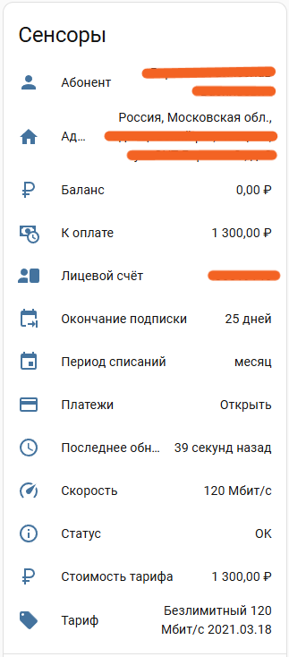
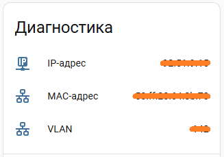

# Умные Сети для Home Assistant

Компонент для получения информации из личного кабинета интернет-провайдера [Умные Сети](http://umnyeseti.ru)

## Установка

### Посредством HACS

> **✔️ Рекомендуемый метод**

1. Установите HACS ([инструкция по установке на оф. сайте](https://www.hacs.xyz/docs/use/download/download/))
2. Найдите `umnyeseti` (или `Умные Сети` или `Smart Networks`) в поиске по интеграциям
3. Установите последнюю версию компонента, нажав на кнопку `Установить` (`Install`)
4. Перезапустите Home Assistant

### Вручную

> **⚠️ Не рекомендуется**

1. Скачайте [последний релиз](https://github.com/DevWorkTech/ha-smartnetworks/releases) дополнения
2. Извлеките архив `umnyeseti.zip` в папку `custom_components/umnyeseti` внутри папки с конфигурацией Home Assistant (создайте её, если она отсутствует)
3. Перезапустите Home Assistant

## Настройка

1. Перейдите в подраздел _"[Интеграции](https://my.home-assistant.io/redirect/integrations)"_ в разделе _"Настройки"_
2. Нажмите кнопку _"Добавить интеграцию"_
3. Введите в поисковую строку: **_Умные Сети_** (англ. **_Smart Networks_**)
4. Выберите найденную интеграцию
5. Следуйте инструкциям мастера по добавлению

---

## Что умеет интеграция

- Отображает баланс лицевого счёта
- Показывает активный тариф, скорость и дату окончания подписки
- Выводит IP, MAC и VLAN для оборудования
- Отслеживает историю платежей
- Поддерживает несколько аккаунтов
- Автоматически обновляет данные каждые 15 минут (или с заданным пользователем интервалом)
- В случае ошибки — сохраняет последние данные и показывает статус проблемы в отдельном сенсоре

---

## Пример работы интеграции

