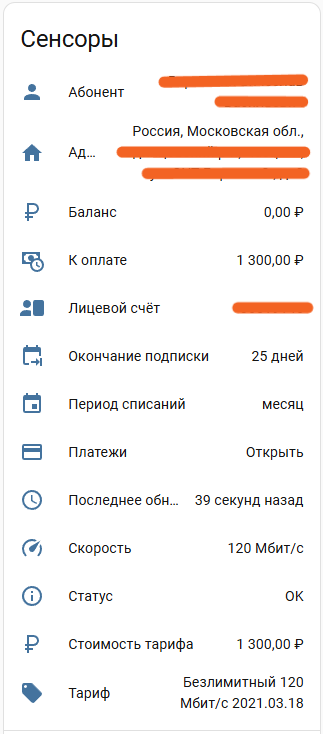
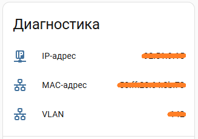

# Умные Сети для Home Assistant

[](https://hacs.xyz)

[](https://t.me/DevWorkTech)

Компонент для получения информации из личного кабинета интернет-провайдера [Умные Сети](http://umnyeseti.ru)

## Установка

### Посредством HACS

> **✔️ Рекомендуемый метод**

1. Установите HACS ([инструкция по установке на оф. сайте](https://www.hacs.xyz/docs/use/download/download/))
2. Найдите `umnyeseti` (или `Умные Сети` или `Smart Networks`) в поиске по интеграциям
3. Установите последнюю версию компонента, нажав на кнопку `Установить` (`Install`)
4. Перезапустите Home Assistant

[](https://my.home-assistant.io/redirect/hacs_repository/?owner=DevWorkTech&repository=ha-smartnetworks&category=integration)

### Вручную

> **⚠️ Не рекомендуется**

1. Скачайте [последний релиз](https://github.com/DevWorkTech/ha-smartnetworks/releases) дополнения
2. Извлеките архив `umnyeseti.zip` в папку `custom_components/umnyeseti` внутри папки с конфигурацией Home Assistant (создайте её, если она отсутствует)
3. Перезапустите Home Assistant

## Настройка

1. Перейдите в подраздел _"[Интеграции](https://my.home-assistant.io/redirect/integrations)"_ в разделе _"Настройки"_
2. Нажмите кнопку _"Добавить интеграцию"_
3. Введите в поисковую строку: **_Умные Сети_** (англ. **_Smart Networks_**)
4. Выберите найденную интеграцию
5. Следуйте инструкциям мастера по добавлению

По умолчанию **проверка SSL-сертификата отключена**, а **интервал обновления — 30 минут**. Оба параметра можно изменить через настройки интеграции. При обновлении уже сохранённые пользовательские значения не перезаписываются.

[](https://my.home-assistant.io/redirect/config_flow_start/?domain=umnyeseti)

---

## Что умеет интеграция

- Отображает баланс лицевого счёта
- Показывает активный тариф, скорость и дату окончания подписки
- Выводит IP, MAC и VLAN для оборудования
- Отслеживает историю платежей
- Поддерживает несколько аккаунтов
- Автоматически обновляет данные каждые 30 минут по умолчанию (или с заданным пользователем интервалом)
- В случае ошибки — сохраняет последние данные и показывает статус проблемы в отдельном сенсоре
- Предупреждает об окончании оплаченного тарифа за 5 дней, 3 дня и за день до окончания, а затем ещё 3 дня после просрочки
- Отправляет предупреждения во все зарегистрированные `notify.mobile_app_*` устройства и одновременно показывает их в панели уведомлений Home Assistant только в разрешённое время 07:00–22:00
- После продления тарифа автоматически убирает устаревшее предупреждение с телефонов и из Home Assistant
- Всегда сохраняет последние RAW request/response API для стандартной функции Home Assistant **«Скачать диагностические данные»** без отдельного переключателя


---

## Имена сенсоров

Начиная с версии **1.0.11** интеграция снова использует стабильные человекочитаемые русские имена сенсоров: «Лицевой счёт», «Баланс», «Абонент», «Тариф», «Стоимость тарифа», «Окончание подписки» и т. д. Технические `unique_id` не изменялись, поэтому существующие сущности, история и автоматизации сохраняются.

## Уведомления об окончании тарифа

Начиная с версии **1.0.10** интеграция самостоятельно контролирует количество дней до окончания оплаченного периода. Предупреждение создаётся один раз при достижении каждого из порогов:

- **5 дней** до окончания тарифа;
- **3 дня** до окончания тарифа;
- **1 день** — уведомление «тариф закончится завтра»;
- **0 дней** — уведомление «тариф заканчивается сегодня»;
- **1, 2 и 3 дня после окончания** (`-1`, `-2`, `-3`) — отдельные уведомления о просрочке.

Все новые предупреждения отправляются строго с **07:00 до 22:00** по локальному часовому поясу Home Assistant. Если порог наступил ночью, он сохраняется как ожидающий и отправляется при следующем обновлении после 07:00. Пороги уведомлений: **5, 3, 1, 0, -1, -2, -3** дней. Значение `0` означает день окончания тарифа, а `-1/-2/-3` — первые три дня просрочки. Все уведомления на порогах `5, 3, 1, 0, -1, -2, -3` отправляются только пока `К оплате > 0`, то есть средств на балансе недостаточно для продления. После третьего дня просрочки предупреждение автоматически убирается.

Сообщение содержит дату окончания, лицевой счёт, текущий баланс и сумму, которой не хватает для следующего продления (если эти данные доступны у провайдера).

Одно и то же предупреждение одновременно:

1. создаётся как постоянное уведомление в панели Home Assistant;
2. отправляется на все зарегистрированные мобильные приложения Home Assistant с действиями `notify.mobile_app_*`.

Для мобильного уведомления используется постоянный `tag`, а для панели Home Assistant — постоянный `notification_id`. Поэтому предупреждение на 3 дня заменяет предупреждение на 5 дней, а предупреждение «завтра» заменяет трёхдневное, вместо накопления нескольких одинаковых уведомлений.

Состояние уведомлений сохраняется в `.storage`, поэтому перезапуск Home Assistant не приводит к повторной отправке одного и того же порога каждые 30 минут по умолчанию. Если оплаченный период продлён и число оставшихся дней увеличилось, интеграция считает прежнее предупреждение устаревшим и автоматически:

- вызывает `clear_notification` с тем же `tag` для мобильных приложений;
- удаляет соответствующее постоянное уведомление из панели Home Assistant.

Если мобильное приложение временно недоступно или его notify-action ещё не зарегистрирован, данные сенсоров продолжают обновляться. Отправка на такое устройство будет повторена при следующих обновлениях в пределах того же порогового дня.

## Авторизация и диагностика ошибок

Начиная с версии **1.0.18** исправлена регрессия Repairs из 1.0.16–1.0.17: восстановлены внутренние методы создания и удаления issue (`_raise_issue` / `_clear_issue`). Из-за их отсутствия успешная первичная настройка могла завершаться ошибкой `UmnyeSetiCoordinator object has no attribute _clear_issue`, а при сетевой ошибке могла возникнуть аналогичная ошибка `_raise_issue`.

Начиная с версии 1.0.9 авторизация повторяет браузерную схему более строго:

1. открывается страница входа и определяется фактический `form action`;
2. извлекается Rails `authenticity_token` / CSRF token и скрытые поля формы;
3. выполняется `POST` без автоматического следования первому редиректу, чтобы отдельно видеть возврат на `/login`;
4. поддерживаются как AJAX-ответы JSON, так и обычный браузерный `302`;
5. любой потенциально успешный ответ обязательно проверяется отдельным запросом данных с теми же cookies; вход считается успешным только если сервер вернул ожидаемый JSON с полем `data`.

Это исключает ложную успешную авторизацию по одному HTTP `200`/`302`. Ошибка `invalid_json` больше не запускает повторный вход: повторная авторизация выполняется только при явно неавторизованной/истёкшей сессии.

Начиная с версии 1.0.8 интеграция подробно фиксирует этап, на котором произошла ошибка авторизации или получения данных: HTTP-статус, конечный URL, `Location`, цепочку редиректов, Content-Type, размер ответа, тип исключения и безопасный фрагмент ответа сервера. Пароль, значения cookies и CSRF/authenticity-токены в журнал не записываются.

Начиная с версии **1.0.21** RAW-диагностика включена постоянно и не имеет отдельной галки или отдельного сенсора. Последние сырые HTTP request/response по этапам `auth.init`, `auth.submit`, `auth.verify` и `data.fetch` доступны штатно через карточку интеграции Home Assistant → меню → **«Скачать диагностические данные»**. В выгрузку входят метод, URL, заголовки, тело запроса, HTTP-статус, заголовки и полное тело ответа. Пароли, cookies, `Authorization`, CSRF/authenticity-токены, payment bridge token и другие секреты маскируются как `[redacted]`; полезные данные ответа остаются доступными для отладки.

Для дополнительного отображения успешных этапов в обычном журнале Home Assistant можно временно включить DEBUG-логирование:

```yaml
logger:
  logs:
    custom_components.umnyeseti: debug
```

При ошибке Home Assistant также создаёт уведомление в разделе «Ремонт», где указываются этап, код ошибки, HTTP-статус, URL, причина и безопасный фрагмент ответа (если он доступен). Те же основные данные отображаются в атрибутах сенсора статуса.

## Пример работы интеграции




### Платежи

Начиная с версии **1.0.13** сенсор «Платежи» показывает историю в компактном виде: отдельная строка `Последний платёж`, а ниже — дата платежа слева и сумма справа. Технический атрибут `pays` и подписи `Платёж 1`, `Платёж 2` и т. д. больше не выводятся в интерфейсе.

### Оплата тарифа

Bridge оплаты использует лёгкую Home Assistant/Yonet-компоновку: заблокированный лицевой счёт, неактивный select **«Оплата 🏦 СБП / 💳 Картой»**, редактируемая сумма и основная кнопка **«💳 Оплатить»**. Под формой сохранён текст **«После нажатия откроется защищённая страница оплаты»**.

Начиная с версии **1.0.25** bridge больше не переходит на SberPay через GET-ссылку `?account=...&amount=...`. После отправки формы Home Assistant сервером выполняет `POST https://sberpay.umnyeseti.ru/ya_kassa/confirm` с полями `account`, `amount`, `mode`, `user_account` и `locale`. Лицевой счёт всегда берётся из актуальных данных интеграции, а пользователь может менять только сумму. Сумма нормализуется в формат `1.00`.

Успех подтверждается только если ответ содержит сообщение **«Проверка введенных данных прошла успешно»** и кнопку со сгенерированной HTTPS-ссылкой на `yoomoney.ru`. После этого bridge автоматически открывает полученную YooMoney-ссылку через `location.replace()`. Любой другой ответ, отсутствие success-блока или YooMoney-ссылки показывает простую страницу ошибки без технических деталей. RAW запроса `payment.confirm` и ответа сохраняется в стандартных диагностических данных Home Assistant.

Ссылка **«💳 Оплатить»** выводится первой в карточках сущностей. Persistent notification и мобильная action-кнопка также открывают token-protected bridge `/api/umnyeseti/payment/<entry>/<token>`, чтобы перед переходом к оплате пользователь мог проверить и скорректировать сумму. Флаг защиты от кнопки «Назад» устанавливается только после успешного `/confirm`: при ошибке подтверждения можно вернуться к форме и исправить сумму.

### Проверка необходимости напоминаний

Начиная с версии **1.0.26** уведомления об оплате создаются только тогда, когда интеграция подтверждает реальную нехватку средств. Для этого используется уже рассчитанное поле `tariff.pay_subscribe = max(стоимость тарифа - баланс, 0)`. Если `К оплате` равно `0`, активно висевшие уведомления удаляются, отложенные пороги сбрасываются, а новые напоминания не отправляются. То же правило действует для повторного напоминания после открытия платёжного шлюза и для уведомлений в первые три дня просрочки.
